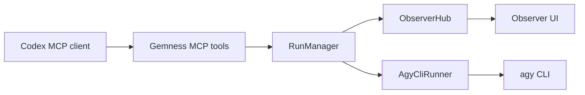

# Gemness Antigravity Observer

Gemness wraps Antigravity CLI (`agy`) as a local MCP advisory server. Codex asks Gemness for a second opinion, Gemness registers a run, invokes `agy` in a background worker, and the Observer UI records the prompt, progress heartbeats, final stdout/stderr, JSON validation, and repair attempts. The Observer UI also lets you rename or remove completed local conversation records. Gemness is a task-clarification bridge, not a bulk context courier: prompts should state the user's intent, cwd, and constraints, then let Antigravity inspect the workspace with its own tools when needed.

## Runtime Flow



`start_antigravity`, `start_antigravity_json`, `start_review_current_diff_with_antigravity`, and `start_follow_up_antigravity` create an Observer run and return immediately with `run_id`, `conversation_id`, and `observer_url`. `get_antigravity_run` returns the current state immediately. `await_antigravity_run` waits only for a short bounded interval, then returns either the final result or the current running state. `cancel_antigravity_run` requests cancellation by `run_id`.

The runner discovers capabilities with `agy --help`, selects `-p`, `--print`, or `--prompt`, and then executes one non-interactive process per run. It captures final output and emits a Gemness response envelope. On Windows, `GEMNESS_AGY_CAPTURE_MODE=auto` uses `pywinpty` because Antigravity CLI can write print-mode text directly to the console instead of stdout/stderr.

## Metadata

Every completed runner envelope includes:

- `run_id`
- `conversation_id`
- `command`
- `cwd`
- `duration_ms`
- `exit_code`
- `auth_status`
- `capture_mode`
- `streaming=false`

Gemness does not claim token-level streaming. Antigravity text output is still captured when the process exits, but long-running runs also produce progress events:

- `antigravity.started`
- `antigravity.heartbeat`
- `antigravity.cancel_requested`
- `antigravity.timeout`
- `antigravity.response`
- `antigravity.stderr`
- `antigravity.exited`

Heartbeat payloads include elapsed time, timeout remaining, pid, capture mode, stdout/stderr byte counts, and last activity age. They let the user distinguish an active long run from a stuck or silent run without pretending that token-level streaming is available.

## Detached Run Control

Detached runs are controlled by `run_id`. `conversation_id` remains the conversation continuity identifier; it is not used to cancel or poll a specific process. RunManager keeps in-memory process handles for active runs, uses transcript events to recover terminal state after restart, scans accepted-run events for `idempotency_key` reuse, and marks unmanaged open runs as cancelled when cancellation is requested after a manager restart.

The compatibility tools `ask_antigravity`, `follow_up_antigravity`, `ask_antigravity_json`, and `review_current_diff_with_antigravity` remain available. They internally start a detached run and then wait until terminal status, preserving existing client behavior while making the detached API the preferred flow for long work.

## Conversation Continuity

Gemness keeps conversation continuity inside Observer transcripts and native Antigravity CLI conversations. `follow_up_antigravity` uses `agy --conversation <id> -p <prompt>` only when Gemness has a trusted Antigravity conversation UUID stored for the run. If that ID is unavailable, Gemness starts a new `agy -p` call with a short conversation-summary prompt. It does not use global `agy --continue`, and it does not forward prior prompts, responses, diffs, file dumps, logs, or transcript payloads.

## Health Checks

`antigravity_health` reports:

- command discovery and Windows fallback paths
- `agy --help` capability status
- selected print-mode flag
- `agy --version`
- best-effort auth status
- Observer and transcript directory state
- workspace cwd and allowed-root state

An auth problem returns structured `auth_required` information instead of crashing.

## Model Selection

Gemness does not pass model flags. Select the model in Antigravity CLI settings or with `/model`. A display choice such as `Gemini 3.5 Flash` is treated as an Antigravity CLI preference.

## Antigravity CLI MCP Config

Codex TOML is the primary supported installation path. Antigravity CLI MCP examples should live separately in `.agents/mcp_config.json` or `~/.gemini/antigravity-cli/mcp_config.json`.

Remote server entries use `serverUrl`:

```json
{
  "mcpServers": {
    "remote-example": {
      "serverUrl": "https://example.test/mcp"
    }
  }
}
```
