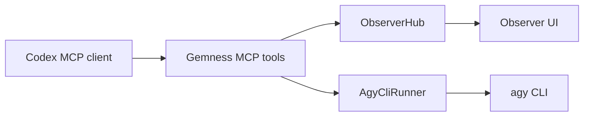

# Gemness Antigravity Observer

Gemness wraps Antigravity CLI (`agy`) as a local MCP advisory server. Codex asks Gemness for a second opinion, Gemness invokes `agy` in print mode, and the Observer UI records the prompt, final stdout/stderr, JSON validation, and repair attempts. The Observer UI also lets you rename or remove completed local conversation records. Gemness is a task-clarification bridge, not a bulk context courier: prompts should state the user's intent, cwd, and constraints, then let Antigravity inspect the workspace with its own tools when needed.

## Runtime Flow



The runner discovers capabilities with `agy --help`, selects `-p`, `--print`, or `--prompt`, and then executes one non-interactive process per run. It captures final output and emits a Gemness response envelope. On Windows, `GEMNESS_AGY_CAPTURE_MODE=auto` uses `pywinpty` because Antigravity CLI can write print-mode text directly to the console instead of stdout/stderr.

## Metadata

Every completed runner envelope includes:

- `run_id`
- `conversation_id`
- `command`
- `cwd`
- `duration_ms`
- `exit_code`
- `auth_status`
- `capture_mode`
- `streaming=false`

Gemness does not claim token-level streaming. Observer UI events are final-output events:

- `antigravity.started`
- `antigravity.response`
- `antigravity.stderr`
- `antigravity.exited`

## Conversation Continuity

Gemness keeps conversation continuity inside Observer transcripts and native Antigravity CLI conversations. `follow_up_antigravity` prefers `agy --conversation <id> -p <prompt>` when a real Antigravity conversation ID has been detected from the local CLI conversation store. If that ID is unavailable, it can use `agy --continue -p <prompt>` for the latest conversation or fall back to a short summary prompt. It does not forward prior prompts, responses, diffs, file dumps, logs, or transcript payloads.

## Health Checks

`antigravity_health` reports:

- command discovery and Windows fallback paths
- `agy --help` capability status
- selected print-mode flag
- `agy --version`
- best-effort auth status
- Observer and transcript directory state
- workspace cwd and allowed-root state

An auth problem returns structured `auth_required` information instead of crashing.

## Model Selection

Gemness does not pass model flags. Select the model in Antigravity CLI settings or with `/model`. A display choice such as `Gemini 3.5 Flash` is treated as an Antigravity CLI preference.

## Antigravity CLI MCP Config

Codex TOML is the primary supported installation path. Antigravity CLI MCP examples should live separately in `.agents/mcp_config.json` or `~/.gemini/antigravity-cli/mcp_config.json`.

Remote server entries use `serverUrl`:

```json
{
  "mcpServers": {
    "remote-example": {
      "serverUrl": "https://example.test/mcp"
    }
  }
}
```
