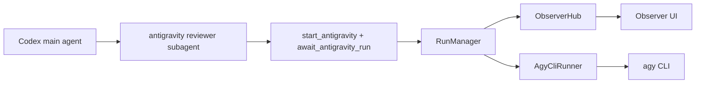

# Gemness Antigravity Observer

Gemness wraps Antigravity CLI (`agy`) as a local MCP advisory server. In the Codex UX, the first-priority path is for the main agent to delegate Antigravity work to an `antigravity reviewer` subagent. That reviewer subagent is the delegated run owner: it starts a background run with `start_antigravity`, waits or polls with `await_antigravity_run`, and returns a concise advisory summary to the parent. Gemness registers a run, invokes `agy`, and the Observer UI records prompt preparation, progress heartbeats, final process metadata, JSON validation, and repair attempts. Heartbeats are summarized as a live status LED and runtime telemetry in the default UI, while the raw heartbeat events remain available in the debug panel. The Observer UI also lets you rename or remove completed local conversation records. Gemness is a task-clarification bridge, not a bulk context courier: prompts should state the user's intent, cwd, and constraints, then let Antigravity inspect the workspace with its own tools when needed.

## Runtime Flow



The default reviewer flow uses `start_antigravity` and `await_antigravity_run`. `start_antigravity` creates an Observer run and returns immediately with `run_id`, `conversation_id`, and `observer_url`; use `mode=ask`, `mode=json`, `mode=review_current_diff`, or `mode=follow_up` to choose the run type. The reviewer should pass the parent `delegation_id` as `idempotency_key` when present. `await_antigravity_run` waits only for a short bounded interval, then returns either the final result or the current running state. Use `timeout_sec=0` to poll immediately without waiting. `cancel_antigravity_run` requests cancellation by `run_id`.

The blocking final-result tools `ask_antigravity`, `follow_up_antigravity`, `ask_antigravity_json`, and `review_current_diff_with_antigravity` are convenience wrappers. They return cleaned advisory text or structured data plus `observer_url`; they do not return the full raw transcript.

The runner discovers capabilities with `agy --help`, selects `-p`, `--print`, or `--prompt`, and then executes one non-interactive process per run. It captures final output, stores raw stdout as a local Observer artifact, and emits only a response preview plus artifact reference in the `antigravity.response` event. On Windows, Gemness always uses `pywinpty` because Antigravity CLI writes print-mode text to the console instead of stdout/stderr.

## Metadata

Every completed runner envelope includes process metadata. Prompt arguments in recorded command arrays are redacted as `[PROMPT_REDACTED]`:

- `run_id`
- `conversation_id`
- `command`
- `cwd`
- `duration_ms`
- `exit_code`
- `auth_status`
- `capture_mode`
- `streaming=false`

Gemness does not claim token-level streaming. Antigravity text output is still captured when the process exits, but long-running runs also produce progress events:

- `antigravity.started`
- `antigravity.heartbeat`
- `antigravity.cancel_requested`
- `antigravity.timeout`
- `antigravity.response`
- `antigravity.stderr`
- `antigravity.exited`

Heartbeat payloads include elapsed time, timeout remaining, pid, capture mode, stdout/stderr byte counts, and last activity age. They let the user distinguish an active long run from a stuck or silent run without pretending that token-level streaming is available. The default conversation timeline hides heartbeat events to avoid noisy chat churn; use the runtime status strip for the latest heartbeat and the raw debug panel for the full event stream.

## Detached Run Control

Detached runs are controlled by `run_id`. `conversation_id` remains the conversation continuity identifier; it is not used to cancel or poll a specific process. RunManager keeps in-memory process handles for active runs, uses transcript events to recover terminal state after restart, scans accepted-run events for `idempotency_key` reuse, and marks unmanaged open runs as cancelled when cancellation is requested after a manager restart.

The reviewer subagent is the first-priority place to run `start_antigravity` and `await_antigravity_run`, because it keeps the main agent free to continue orchestration while the Observer run remains inspectable. The reviewer must not spawn or delegate another subagent. The blocking tools remain useful for small one-shot calls and compatibility with simpler clients when multi-agent support is unavailable.

Gemness uses a single health owner for each task. When the main agent checks health or reuses the Codex host capability cache before spawning a reviewer, it passes a `Gemness health handoff` containing cwd, health status, `codex_host.multi_agent.available`, and whether `antigravity_health` was called. A reviewer that receives an `ok` or `warning` handoff for the same cwd skips `antigravity_health` and starts with `start_antigravity`. If no handoff exists and the reviewer is the first Gemness actor, the reviewer may run health once and then continue the task.

After the reviewer is spawned in background or detached mode, the main agent should keep working on non-overlapping local work such as reading relevant code, checking diffs, running available tests, or preparing acceptance criteria. It waits for the reviewer only when the advisory is needed for a decision or final report.

Delegated run ownership is also single-owner. When the main agent spawns the reviewer, it passes a `delegated_run handoff` containing cwd, task, mode, optional schema or parent session id, and a parent-generated `delegation_id`. The reviewer uses that exact `delegation_id` as `idempotency_key` for `start_antigravity`. While the reviewer owns the run, the main agent does not call `start_antigravity`, `await_antigravity_run`, or blocking Gemness wrappers for the same task.

The main agent may take over only when reviewer spawn fails, the reviewer explicitly fails or times out, the reviewer returns only a `run_id` without final advisory, or the user explicitly requests main-agent direct execution. During takeover, the main agent should not start a duplicate run; it should await, cancel, or follow up using existing run or session identifiers when available.

## Conversation Continuity

Gemness keeps conversation continuity inside Observer transcripts and native Antigravity CLI conversations. `follow_up_antigravity` uses `agy --conversation <id> -p <prompt>` only when Gemness has a trusted Antigravity conversation UUID stored for the run. If that ID is unavailable, Gemness starts a new `agy -p` call with a short conversation-summary prompt. It does not use global `agy --continue`, and it does not forward prior prompts, responses, diffs, file dumps, logs, or transcript payloads.

## Health Checks

`antigravity_health` reports:

- command discovery and Windows fallback paths
- `agy --help` capability status
- selected print-mode flag
- `agy --version`
- best-effort auth status
- Observer and transcript directory state
- workspace cwd and allowed-root state
- Codex host multi-agent capability cache state

An auth problem returns structured `auth_required` information instead of crashing.

The first Gemness health check in a Codex host should include the main agent's host-side multi-agent discovery result through `codex_multi_agent_available` and `codex_multi_agent_evidence`. Gemness stores that result in `~/.gemness/codex-host-capabilities.json` and returns it later in the `codex_host` health payload, so the same Codex host does not need to re-probe spawn/delegation tools for every repository.

Within a single task, do not run health from both the main agent and the reviewer subagent. The main agent should own health when it is the one spawning the reviewer; otherwise the reviewer can own it once and proceed.

## Model Selection

Gemness does not pass model flags. Select the model in Antigravity CLI settings or with `/model`. A display choice such as `Gemini 3.5 Flash` is treated as an Antigravity CLI preference.

## Antigravity CLI MCP Config

Codex TOML is the primary supported installation path. Antigravity CLI MCP examples should live separately in `.agents/mcp_config.json` or `~/.gemini/antigravity-cli/mcp_config.json`.

Remote server entries use `serverUrl`:

```json
{
  "mcpServers": {
    "remote-example": {
      "serverUrl": "https://example.test/mcp"
    }
  }
}
```
