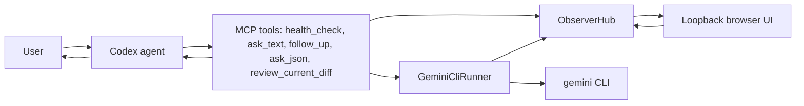
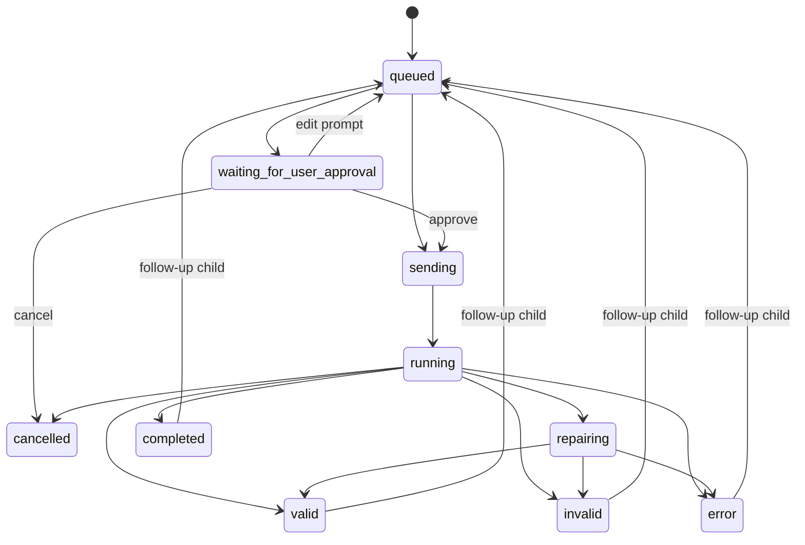

# Gemness Observer Architecture

## Overview



`ObserverHub` owns session IDs, session state, events, redaction, intervention queues, JSONL transcript persistence, and the local web server. Gemini remains advisory: Codex still decides how to use the returned text or JSON.

By default `GemnessService` starts the loopback Observer web server during MCP server initialization (`GEMNESS_OBSERVER_START_ON_INIT=true`). That makes the fixed dashboard URL `http://127.0.0.1:56755` usable before `ask_text`, `follow_up`, `ask_json`, or `review_current_diff` returns the dashboard `observer_url`. The UI lists conversations from the shared transcript directory and follows the newest running session, so users do not need to remember session IDs.

## Tool Pipeline

`ask_text`:

1. create session
2. render and redact prompt events
3. optionally wait for approval or prompt edit
4. run Gemini CLI with `--output-format stream-json` by default and no `-m` flag unless a model was explicitly configured
5. record streamed response deltas, detected model stats, final response, stderr, exit, and final result

`follow_up`:

1. receive a previous `parent_session_id` and a new prompt
2. create a new observer run under the same conversation when continuing the latest turn
3. reuse Gemini CLI native resume when supported
4. otherwise send a redacted recent-turn summary fallback
5. return the new `session_id` plus the shared `conversation_id`

`ask_json`:

1. render prompt plus JSON Schema
2. run Gemini CLI
3. parse CLI JSON envelope and extract `response`
4. remove code fences and extract JSON candidate
5. parse JSON
6. validate against JSON Schema
7. if parse or validation fails, run one repair prompt
8. return `valid`, `invalid`, or `error`

`review_current_diff`:

1. MCP server resolves the requested `cwd` or the process working directory
2. MCP server validates `base_ref`
3. MCP server runs `git diff --no-color <base_ref> --` in the resolved `cwd`
2. diff is size-limited
3. diff is included in a review prompt
4. review response is validated against the built-in review schema
5. UI renders review findings when present

`health_check`:

1. resolves the requested `cwd` or process working directory
2. reports server, Python, observer, transcript, workspace, and Gemini CLI configuration
3. checks Gemini CLI command resolution and version without calling a model
4. returns warnings instead of crashing when Gemini CLI is missing or unavailable

When startup preloading is disabled, `health_check` still starts the Observer before reporting its URL.

## Gemini CLI Output Choice

This implementation uses `--output-format stream-json` as the default canonical mode. The runner records assistant message deltas as `gemini.delta` events for the Observer UI, then synthesizes the same JSON envelope shape expected by `ask_text`, `ask_json`, and repair parsing. Set `GEMNESS_GEMINI_OUTPUT_FORMAT=json` to use final-response-only mode.

By default Gemness does not set `GEMNESS_MODEL` and does not pass `-m` to Gemini CLI, allowing the CLI to select its default model path. When stream stats report a model name, Gemness records a `gemini.model_detected` event and updates the Observer session model label.

For Gemini CLI headless mode, the runner defaults to `--approval-mode plan` and does not pass `--skip-trust`. It also sets `GEMINI_CLI_TRUST_WORKSPACE=true` for the Gemini child process so real observer sessions do not stop on Gemini CLI's interactive workspace trust prompt. Set `GEMNESS_GEMINI_TRUST_WORKSPACE=false` or `GEMINI_CLI_TRUST_WORKSPACE=false` only when you explicitly want to disable that workspace trust environment value. Set `GEMNESS_GEMINI_SKIP_TRUST=true` only when you explicitly want to bypass Gemini CLI trust checks in your local environment.

## Event Schema

Events are persisted as JSONL under `GEMNESS_TRANSCRIPT_DIR`.

```ts
type ObserverEvent = {
  event_id: string;
  session_id: string;
  parent_session_id?: string;
  ts: string;
  type:
    | "session.created"
    | "prompt.rendered"
    | "prompt.redacted"
    | "prompt.pending_approval"
    | "prompt.sent"
    | "gemini.started"
    | "gemini.delta"
    | "gemini.response"
    | "gemini.stderr"
    | "gemini.exited"
    | "json.extracted"
    | "json.parse_failed"
    | "json.validation_failed"
    | "json.validation_passed"
    | "repair.started"
    | "repair.prompt_sent"
    | "repair.response"
    | "repair.validation_passed"
    | "repair.validation_failed"
    | "intervention.received"
    | "intervention.applied"
    | "session.completed"
    | "session.cancelled"
    | "session.error";
  role: "codex_mcp" | "gemness" | "user" | "system";
  tool_name?: "ask_text" | "ask_json" | "review_current_diff";
  phase?: string;
  payload: Record<string, unknown>;
  redacted?: boolean;
};
```

## Session State Machine



Statuses used by sessions:

```ts
type SessionStatus =
  | "queued"
  | "waiting_for_user_approval"
  | "sending"
  | "running"
  | "repairing"
  | "valid"
  | "invalid"
  | "error"
  | "cancelled"
  | "completed";
```

## Intervention Semantics

- `edit_prompt`: allowed before send. Replaces the prompt draft and records a new `prompt.rendered` event.
- `add_instruction`: allowed before send. Appends a user intervention block to the prompt.
- `approve`: allowed while waiting for approval. Sends the current draft.
- `cancel`: allowed before send or while running. Cancels the session or terminates the subprocess.
- `interrupt_retry`: allowed while running. Terminates the subprocess and creates a child session with the original prompt, partial output, and user instruction.
- `follow_up`: allowed after completion. Creates a parent-linked child session with a redacted transcript summary.

## API

The HTML UI is served from the loopback-only root URL. API, SSE, export, and intervention routes are local loopback endpoints on that same Observer server and do not require URL tokens.

- `GET /api/sessions`
- `GET /api/sessions/<session_id>?raw=0`
- `GET /api/sessions/<session_id>/export?raw=0`
- `GET /api/events?raw=0`
- `POST /api/config`
- `POST /api/sessions/<session_id>/interventions`

Intervention request body:

```json
{
  "action": "interrupt_retry",
  "instruction": "Focus on data loss risk."
}
```

## Manual Test Flow

1. Install in a project virtual environment with `python -m pip install -e .`.
2. Configure Codex with `docs/codex-mcp-config.example.toml`, including `enabled_tools` and `default_tools_approval_mode = "prompt"`.
3. Run `codex mcp list`.
4. Open Codex TUI, run `/mcp`, and confirm `gemness` is active.
5. Ask Codex: `use gemness: run health check`.
6. Open `http://127.0.0.1:56755`, then call `ask_text`.
7. Confirm the root page switches to the live session and shows prompt, streamed response, and final result.
8. Call `ask_json` with a schema.
9. Confirm JSON extraction, validation, and any repair result are visible.
10. Call `review_current_diff`.
11. Confirm review findings render in the UI.
12. Set `GEMNESS_PAUSE_BEFORE_SEND=true`, call a tool, edit the queued prompt, then approve.
13. During a long-running call, use `Interrupt and retry`.
14. On a completed session, use `Continue with instruction`.
15. Use `Export JSON` and confirm the default export is redacted.

## Known Limitations

- A headless Gemini subprocess cannot reliably receive live prompt injection after it has started.
- Running intervention therefore uses `interrupt & retry`: terminate the process, record partial output, and run a child session.
- Streaming can vary by Gemini CLI version and output format.
- `ask_json` displays streaming deltas but still validates the synthesized final response envelope.
- The UI shows the prompt MCP actually sent to Gemini and Gemini output. It does not expose Codex hidden reasoning or hidden system/developer instructions.
